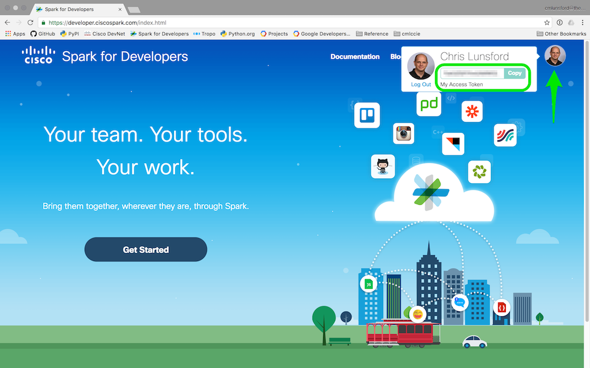

.. _Quickstart:

.. currentmodule:: ciscosparksdk

==========
Quickstart
==========

*Dive in!*  ...to get started using the ciscosparksdk package:

Make sure that you have:

* A Cisco Spark Account *(a free account works fine,* `sign-up for one here`__ *)*
* ciscosparksdk :ref:`installed <Install>`
* ciscosparksdk :ref:`upgraded to the latest version <Upgrade>`

__ ciscospark.com_

Get your Spark Access Token
---------------------------

To interact with the Cisco Spark APIs, you must have a **Spark Access Token**.
A Spark Access Token is how the Spark APIs validate access and identify the
requesting user.

To get your personal access token:

    1. Login to `developer.ciscospark.com`_
    2. Click on your avatar in the upper right hand corner
    3. Click 'Copy' to copy your access token to your clipboard

Use your Spark Access Token
---------------------------

As a `best practice`__, you can store your Spark access token 'credential' as
an environment variable in your development or production environment.  By
default, ciscosparksdk will look for a ``SPARK_ACCESS_TOKEN`` environment
variable when creating new connection objects.

__ https://12factor.net/config

There are many places and diverse ways that you can set an environment
variable, which can include:

    * A setting within your development IDE
    * A setting in your container / PaaS service
    * A statement in a shell script that configures and launches your app

It can be as simple as setting it in your CLI before running your script...

.. code-block:: bash

    $ SPARK_ACCESS_TOKEN=your_access_token_here
    $ python myscript.py

...or putting your credentials in a shell script that you ``source`` when your
shell starts up or before your run a script:

.. code-block:: bash

    $ cat mycredentials.sh
    export SPARK_ACCESS_TOKEN=your_access_token_here
    $ source mycredentials.sh
    $ python myscript.py

However you choose to set it, if you have your access token stored in a
``SPARK_ACCESS_TOKEN`` environment variable when using ciscosparksdk, you are
good to go.  ciscosparksdk will pull and use this access token, by default.

If you don't want to set your access token as an environment variable, or
perhaps your application will acquire access tokens via some other means, you
can manually provide your access token when creating new objects.

*Copyright (c) 2017 Cisco Systems, Inc.*

.. _ciscospark.com: https://www.ciscospark.com/
.. _developer.ciscospark.com: https://developer.ciscospark.com/
.. _PyCharm: https://www.jetbrains.com/pycharm/
.. _PEP 20: https://www.python.org/dev/peps/pep-0020/
